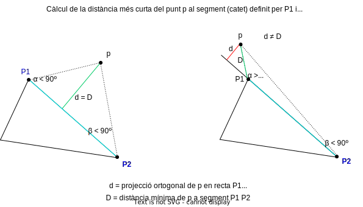

# INTRODUCCIÓ

Aquesta carpeta conté programes en Java que he fet sota el marc del cicle formatiu de grau superior de primer de DAW/DAM. Per tal d'executar els programes, si n'hi ha múltiples en una carpeta es poden posar dins d'un package a netbeans i es pot executar la classe que tingui el main.

# Programes de Programació Orientada a Objectes

## Classe Triangle

Dins la carpeta [Practica1](./practica1/) podem veure tres classes que implementen operacions I atributs amb els que treballar amb diferents tipus d'objectes del pla (punt, cercle i triangle). En especial m'agradaria fer referència a la classe [Triangle](./practica1/Triangle.java) que, igual que les altres, podeu provar des de l'arxiu java [Practica_1](./practica1/Practica_1.java).

Dins la classe Triangle he definit la idea de triangle a partir de tres punts P (vegeu classe [Punt](./practica1/Punt.java)). També he implementat divereses funcions per calcular: 
- el perímetre.
- l'àrea de qualsevol triangle, mitjançant la fórmula d'heron.
- un parell de funcions que permeten trobar, en conjunt,**la distància mínima de qualsevol punt del pla a un triangle qualsevol**[^1], éssent aquesta la funcionalitat que comentaré en els següents subapartats de la classe Triangle. 

### Càlcul de la distància de p a un triangle t donat

Per tal de poder trobar la distància mínima d'un punt **p** a un triangle de vèrtexs **P1**, **P2**, **P3** he seguit el procediment que he considerat que dóna la millor aproximació: en primer lloc, he trobat una forma de calcular la distància mínima del punt **p** a un catet del triangle, és a dir, la distància mínima a un segment concret (per exemple, el segment *P1 P2*). En segon lloc, he trobat la distància mínima del punt **p** als altres dos segments (*P2 P3* i *P3 P1*). En tercer lloc, tenint ja calculades les tres distàncies anteriors, he pogut trobar la distància mínima de **p** al triangle tot fent la mínima de les tres distàncies anteriors.

Més en detall, és necessari fer notar que per a fer el càlcul de la distància de **p** a un catet/segment qualsevol no sempre podrem trobar la distància correcta aplicant la fórmula de càlcul de la distància d'un punt a una recta. Per al cas que ens ocupa, aquesta fórmula funciona si i només si la projecció ortogonal del punt **p** a la recta que conté el segment que ens interessa (e.g, segment *P1 P2*) cau DINS d'aquest segment. Si, pel contrari, aquesta projecció caigués en la recta que conté el segment però no en el propi segment, aleshores la fórmula de càlcul de la distància d'un punt a una recta no ens serviria, com veurem a continuació.

 Per tal de poder saber en quin cas dels dos ens trobem, hem de mirar, per trigonometria, si els cosinus dels angles **α** i **β** ens indiquen que ambdós angles siguin aguts -vegeu imatge de sota per entendre-ho i nota al peu [^2]-:

  

_Si els dos angles són aguts_, aleshores la distància mínima del punt **p** al segment mencionat sí que la podriem trobar fent la <ins>projecció ortogonal del punt **p** a la recta que conté el segment</ins>, ja que cau també en el segment (a la imatge de damunt podeu veure un cas com aquest -al triangle de l'esquerra, la distància en verd-). En cas contrari, _si un dels angles fos superior a 90 graus_, tindriem que la projecció de **p** no cauria dins el segment *P1 P2* i, aleshores, la distància no es podria trobar fent la projecció ortogonal, que ens trobaria una distància més petita, la distància cap a la recta que conté el segment; però no pas cap al segment. En aquest últim cas, hauriem de trobar la <ins>distància mínima cap al vèrtex més proper</ins> (a la imatge de damunt podeu veure el triangle de la dreta, distància en verd -la mínima- i en vermell -la de la projecció ortogonal, que no hagués estat correcta si l'haguessim donat com a bona-).

En la funció `distanciaPuntAcatet(Punt P1, Punt P2, Punt p, boolean debugging)` hem utilitzat quatre vectors per trobar si els dos angles **α** i **β** són aguts o no: 

Així doncs, per trobar el cosinus de l'angle **α** hem fet servir dos vectors (el vector que va de P1 a P2 i el vector que va de  que va de P1 a p), que denominem:

-  $$\vec{u}_{P_1 \to P_2}$$
-  $$\vec{v}_{P_1 \to p}$$

Anàlogament, per trobar el cosinus de l'angle **β** hem pres el vector que va de P2 a P1 i el vector que va de P2 a p, que amb la notació vectorial escollida són:
 
 - $$\vec{x}_{P_2 \to P_1}$$
 - $$\vec{w}_{P_2 \to p}$$
 
A tall d'exemple, per trobar el cosinus de l'angle dels dos primers vectors **u** i **v** hem fet servir l'expressió clàssica de dividir el producte vectorial dels dos vectors entre el producte dels seus mòduls:

$$ cos(\alpha) = {\vec{u} \cdot \vec{v} \over ||\vec{u}|| \cdot ||\vec{v}||} $$

Expressió clàssica que queda representada en la següent línia de codi:

https://github.com/blackcub3s/programesJava/blob/02e74f75dc474e2331168dc4911930cf64bf8082/practica1/Triangle.java#L173-L175

Línia que crida a sengles funcions que hem programat per calcular el producte escalar i el mòdul d'un vector:

https://github.com/blackcub3s/programesJava/blob/02e74f75dc474e2331168dc4911930cf64bf8082/practica1/Triangle.java#L63-L73

Agafant com a exemple el triangle de l'esquerra en l'anterior figura, el que expliquem amb els vectors queda representat gràficament de la següent manera:

     

La funció que implementa la distància del punt **p** a un segment d'extrems P1 P2 és la funció `distanciaPuntAcatet(Punt P1, Punt P2, Punt p, boolean debugging)` i podeu veure-la completa a continuació:

https://github.com/blackcub3s/programesJava/blob/ddd205c55619b16cd3aa8901763c7ef209b79845/practica1/Triangle.java#L151-L201

Per fer la distància mínima de **p** al triangle s'ha fet amb la funció `calcularDistancia(Punt p)`. Aquesta funció calcula el mínim de les tres distàncies possibles de **p** als catets, invocant tres cops al mètode `distanciaPuntAcatet([...])`: així, de forma respectiva en cada invocació, li passarà les tres combinacions de vèrtexs possibles que generen els tres catets (segments) juntament amb el punt p:

https://github.com/blackcub3s/programesJava/blob/ddd205c55619b16cd3aa8901763c7ef209b79845/practica1/Triangle.java#L209-L224

Podeu veure un esquema visual del que faria la funció `calcularDistancia(Punt p)` prenent el triangle de la figura inicial, però ampliant-ho per als tres catets del mateix. La funció obtindria les tres distàncies mínimes de p a cada catet del triangle i, acte seguit, retornaria la mínima de les tres; éssent la distància retornada la distància mínima del punt p al triangle, la que estàvem buscant:

     

# Programes d'algorismes

## Càlcul d'un nombre primer

Imaginem-nos que se'ns demana una funció que ens retorni si un nombre primer `n` que li passem per paràmetre és primer o no. Una forma de calcular si un nombre `n` és primer és comprovar si no existeixen divisors d'aquest nombre entre el 2 i el nombre `n-1`. És una forma correcta, però ineficient de fer-ho. Una implementació eficient passa per iterar fins a arrel de n. Com ho hem fet aquí:

https://github.com/blackcub3s/programesJava/blob/5d0fe3bc092bc66a256a69135b0ac0cbce3b78b7/algorismes/EsPrimoEntregableSanti.java#L2-L31

[^1]: No es podrà calcular la distància d'un punt a un triangle que tingui un catet completament vertical perquè hem definit els catets del triangle com a funcions matemàtiques (rectes en el pla de la forma y = mx + b, que no admeten múltiples valors de y per a un x donat).
[^2]: la projecció ortogonal del punt p caurà en el segment P1 P2 si i només si l'angle definit pels punts p, P1 i P2 (angle **α**), per una banda,i l'angle definit pels punts P1, P2, p (angle **β** ), per l'altra, són
tots dos compresos entre 0 i 90 graus (ambdós angles inclosos) cosa que es donarà quan els cosinus dels dos angles
estiguin dins de l'interval tancat [0,1].

# Programes amb arrays bi-dimensionals (matrius)

Podem trobar-los dins la carpeta [U06_Matrius](./U06_Matrius/). Els programbes destacats son el 4 i el 5.

## Generació d'un quadrat llatí (Exercici4)

## Sistema de gestió d'alumnes (Exercici5)

En l'exercici5 se'ns demana:

<pre>

Crear un programa per a gestionar les notes d'un grup escolar (amb un grup de 20 alumnes i tres assignatures) que permeti:

- Introduir les notes.
- Calcular la nota mitjana de cada alumne.
- Calcular la màxima nota de cada assignatura o mòdul.
- Calcular la nota mitjana per mòdul i quants alumnes la sobrepassen.

</pre>
La resolució la tenim dins el fitxer [Exercici5.java](./U06_Matrius/Exercici5.java). 

Per resoldre aquest exercici he fet servir una variable global que mostra el nombre d'estudiants que tenim actualment al sistema, la variable nreEstudiantsAfegits. Aquesta variable no la passem per paràmetre a les diferents funcions sino que en ser una variable global estàtica està disponible en tots els atributs estàtics. La resta de variables amb les que treballo (la que guarda la matriu de notes -**notesGrup**- i la que guarda l'array d'strings que conformem els noms dels estudiants -**nomsAlumnes**- les mantinc dins al main i les passo com a paràmetre -per referència, ja que són arrays- a les diferents funcions o mètodes amb els que hem distribuit el codi):

Fora del main la variable global, com hem dit:

https://github.com/blackcub3s/programesJava/blob/f3be083e339333e141b6043cd6916c4880967f7c/U06_Matrius/Exercici5.java#L19-L24

Dins el main, les arrays que passem per referencia a múltiples funcions:

https://github.com/blackcub3s/programesJava/blob/f3be083e339333e141b6043cd6916c4880967f7c/U06_Matrius/Exercici5.java#L383-L385

El programa implementa una especie d'interfície gràfica feta amb la terminal, així que com que en java no és trivial esborrar el contingut de la terminal, cada cop que vull mostrar canvi en la interfície he generat molts salts de línia perquè el contingut antic quedi amagat.

 